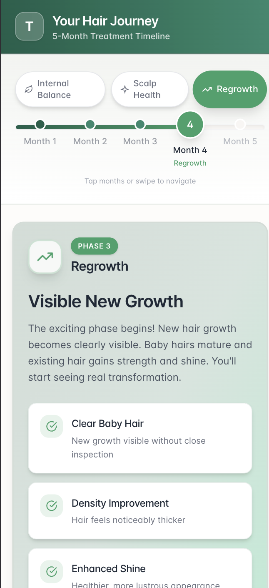
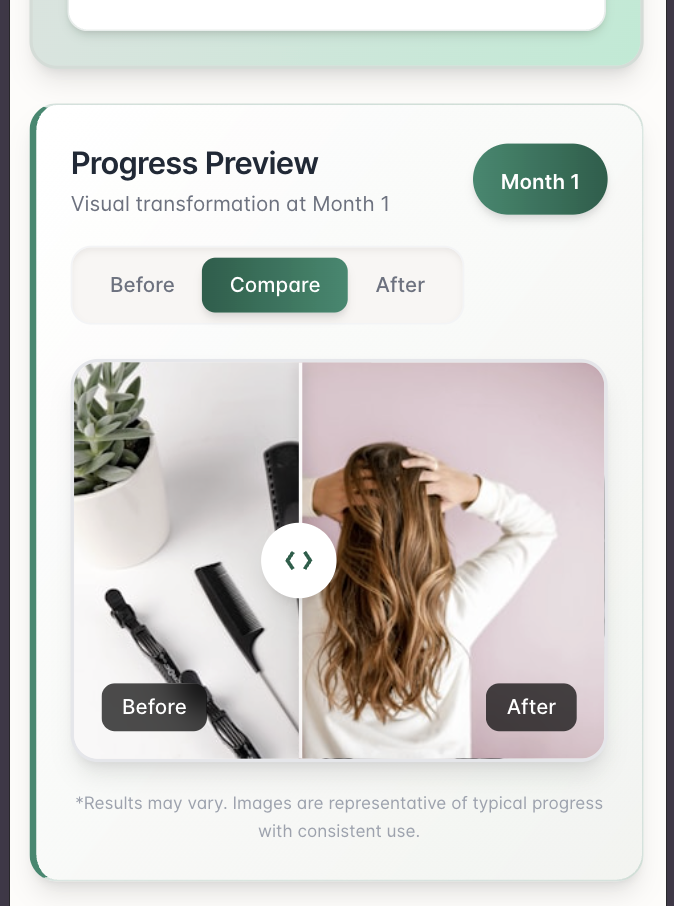

# Traya Hair Journey - Interactive Timeline

A React-based interactive timeline application showcasing a 5-month hair treatment journey with Traya. Built as a frontend assignment demonstrating modern UI/UX patterns and React best practices.

## Features

- **Interactive Timeline**: Navigate through 5 months of treatment with clickable month markers and smooth transitions
- **Phase Indicators**: Three distinct phases (Internal Balance, Scalp Health, Regrowth) with color-coded progress
- **Before/After Comparison**: Interactive slider to compare treatment progress with drag and touch support
- **Customer Reviews**: Dynamic verified reviews section with star ratings for each treatment phase
- **Responsive Design**: Fully responsive layout optimized for mobile and desktop
- **Accessibility**: ARIA labels, keyboard navigation, and semantic HTML

## Screenshots

<table>
  <tr>
    <td width="50%">
      <strong>Phase Information</strong><br/>
      
      <br/><em>Treatment phase with highlights</em>
    </td>
    <td width="50%">
      <strong>Before/After Comparison</strong><br/>
      
      <br/><em>Interactive slider comparison</em>
    </td>
  </tr>
  <tr>
    <td width="50%">
      <strong>Customer Reviews</strong><br/>
      
      <br/><em>Verified testimonials with ratings</em>
    </td>
    <td width="50%">
      <strong>Footer & Trust Indicators</strong><br/>
      
      <br/><em>Trust badges and CTA section</em>
    </td>
  </tr>
</table>

## Tech Stack

- **React 18** - UI library with hooks
- **TypeScript** - Type safety
- **Tailwind CSS 4** - Utility-first styling
- **Vite** - Build tool and dev server

## Project Structure

```
src/
├── components/
│   └── TrayaJourney/
│       ├── TrayaJourney.tsx    # Main container component
│       ├── Timeline.tsx         # Interactive timeline with phases
│       ├── PhaseInfo.tsx        # Phase details and highlights
│       ├── ImageComparison.tsx  # Before/after slider
│       ├── ReviewsWidget.tsx    # Customer reviews section
│       ├── types.ts             # TypeScript interfaces
│       └── index.ts             # Barrel exports
├── data/
│   └── journeyData.json         # Mock data for phases, months, reviews
├── assets/                      # Screenshots and images
└── index.css                    # Global styles and theme
```

## Getting Started

### Prerequisites

- Node.js 18+
- npm or yarn

### Installation

```bash
# Clone the repository
git clone <repository-url>
cd traya

# Install dependencies
npm install

# Start development server
npm run dev
```

### Build

```bash
# Production build
npm run build

# Preview production build
npm run preview
```

## Key Components

### Timeline
- Horizontal progress track with phase segments
- Animated month markers with current selection highlight
- Hidden range slider for touch/accessibility support

### PhaseInfo
- Dynamic phase badge with icon
- Month title and description
- Highlight cards showing expected outcomes

### ImageComparison
- Three view modes: Before, After, Compare (slider)
- Touch and mouse drag support
- Keyboard navigation (arrow keys)
- Loading states with skeleton

### ReviewsWidget
- Star ratings with average calculation
- Verified badge indicators
- Review cards with user avatars


